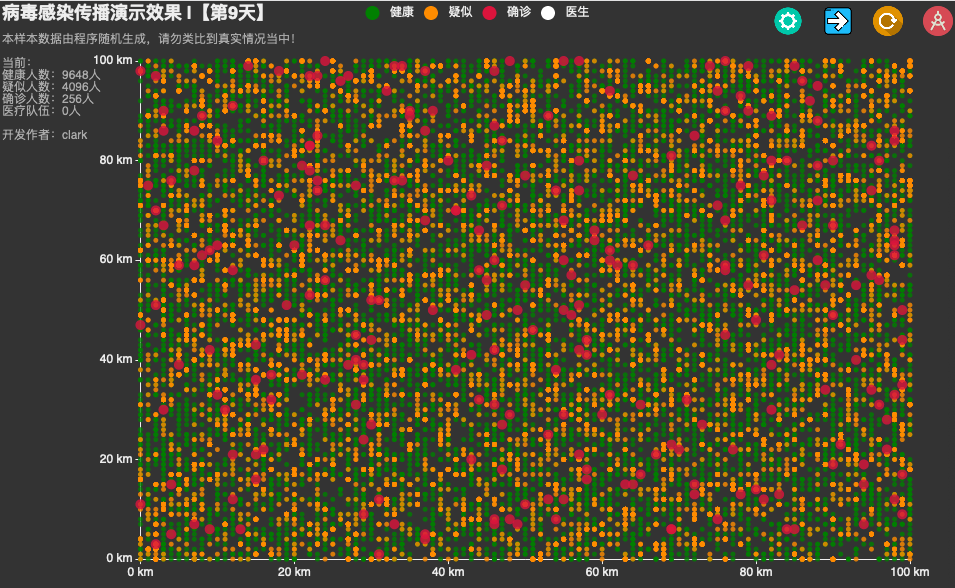

# 模拟病毒感染过程

#### 介绍
利用PHP程序结合坐标散点图来模拟病毒传播感染过程，所有数据过程都是最简单的数学计算，并不能代表真实情况，仅用于演示说明！

#### 界面截图

#### 安装教程

1.  下载文件包
2.  上传到自己服务器目录下
3.  直接运行index.php文件即可

#### 使用说明

1.  common.php——公共配置文件，文件内有具体注释说明
2.  function.php——计算工具，包含初始化和一些简单的模型计算
3.  index.php——执行文件

#### 关于
##### 作者：杜、刘 、袁
##### Linux课程设计
  
    
    
###### 项目修改自 https://gitee.com/dongyao/virus 感谢Clark！
